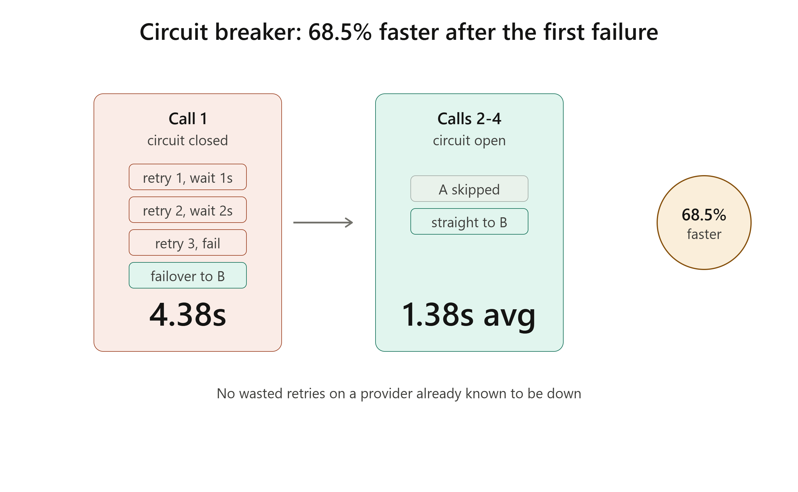
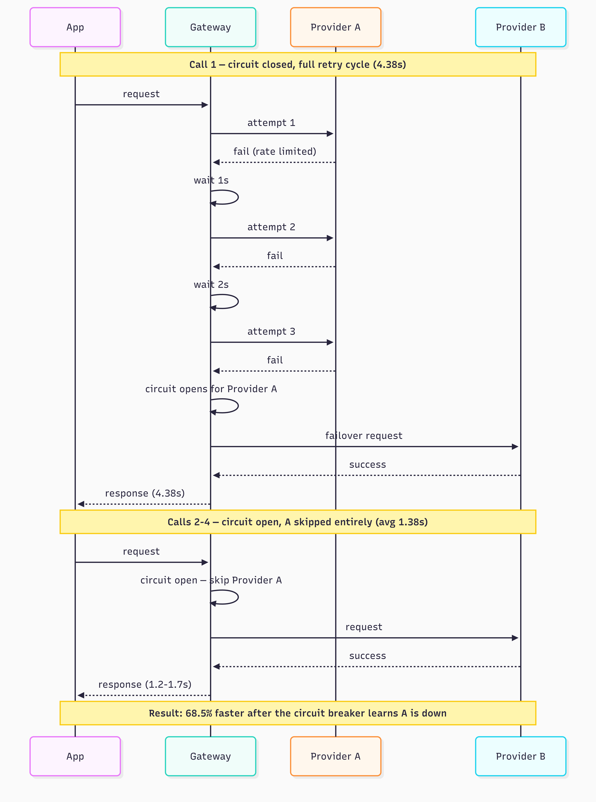

# Resilient LLM gateway

A middleware layer that sits between an application and LLM providers, absorbing rate limits, timeouts, and outages so the application never sees them. Retries with exponential backoff, automatically fails over to a backup provider, and uses a circuit breaker to stop wasting time on a provider that's clearly down — all driven by a single YAML config file.

## Why this is different from a basic retry wrapper

Most "add retries to your LLM calls" tutorials stop at a `@retry` decorator. This gateway adds three things production systems actually need:

- **Automatic failover** — if a provider exhausts its retries, the gateway switches to a backup provider instead of just failing.
- **A circuit breaker** — after repeated consecutive failures, the gateway stops even attempting the failing provider for a cooldown period, instead of burning a full retry cycle on every single request while a provider is down.
- **Cost tracking per call** — every response records its real token-based cost, including wasted cost from failed attempts before a successful failover.
- **Config-driven behavior** — retry counts, backoff timing, and which provider is primary vs. backup are all set in `config.yaml`, not hardcoded. Disabling failover in the config genuinely changes behavior (verified below), not just cosmetically read and ignored.

## Architecture

```
Request
  ↓
Circuit breaker check (Provider A)
  ├─ open  → skip straight to Provider B
  └─ closed/half-open
       ↓
   Provider A (retry ×3, exponential backoff: 1s, 2s, 4s)
       ├─ success → return response + cost
       └─ exhausted → open circuit, fail over
                          ↓
                      Provider B (retry ×3, same backoff)
                          ├─ success → return response + cost
                          └─ exhausted → raise error
```

**Stack:** Python, OpenAI API, `tenacity` for retry/backoff, `pyyaml` for config.

Note: both "Provider A" and "Provider B" route through OpenAI in this version (using different models, `gpt-4o-mini` and `gpt-4o`) to demonstrate the failover mechanism without requiring a second paid provider account. Swapping in a real second provider (e.g. Anthropic) only requires adding one new function with the same signature as the existing provider functions.

## Fault injection, not hope

Real rate limits and outages don't happen on a reliable schedule, so this project includes a fault injector that deliberately simulates provider failures on command. This is a standard practice in resilience engineering sometimes called chaos testing used specifically because waiting for a real outage to validate recovery logic isn't a repeatable test strategy.

## Measured results

### Stress test — 20 requests across 3 scenarios

| Metric | Result |
|---|---|
| Success rate | **100%** |
| Requests requiring at least one retry | 50% |
| Requests requiring failover to Provider B | 25% |
| Added latency for retried requests vs. clean requests | +3.28s |

Every request eventually succeeded, including the 25% that hit a hard failure on Provider A requiring a full failover.

### Circuit breaker — latency savings on repeated failures

The real test of a circuit breaker is what happens on the *second* failure, not the first. Four consecutive requests were made against a provider configured to fail every time:

| Call | Circuit state | Time |
|---|---|---|
| 1 | Closed — full retry cycle attempted | 4.38s |
| 2 | Open — Provider A skipped entirely | 1.17s |
| 3 | Open — Provider A skipped entirely | 1.26s |
| 4 | Open — Provider A skipped entirely | 1.71s |

**Result: a 68.5% reduction in average latency** on calls 2-4 versus call 1, by recognizing a provider was already known to be down and skipping the wasted retry cycle entirely.





## Config genuinely drives behavior — proven, not assumed

To confirm `config.yaml` actually controls behavior rather than being read and ignored, the same fault scenario was run twice with only the config changed:

**`failover.enabled: true`** — Provider A exhausts retries → automatic failover to Provider B → success.

**`failover.enabled: false`** — Provider A exhausts retries → gateway raises a clear error and stops, even though Provider B is configured as the backup:
```
RuntimeError: Primary provider failed after all retry attempts, and
failover is disabled. Provider A final error: Simulated rate limit
exceeded for testing.
```

Same code, same injected failure, two different outcomes — driven entirely by the YAML file.

## A bug found along the way

Tenacity's `stop_after_attempt(n)` counts total calls, not retries *after* the first attempt. An initial config of `MAX_ATTEMPTS_PER_PROVIDER = 4` was actually allowing 4 full attempts (1 initial + 3 retries) rather than the intended 3 total attempts. Fixed by setting it to 3 and verifying the backoff sequence (1s, 2s waits — only 2 delays between 3 attempts) matched expectations exactly.

## Project structure

```
resilient-llm-gateway/
├── gateway.py          # core resilience logic: retry, failover, circuit breaker
├── providers.py        # provider call functions (both route through OpenAI)
├── pricing.py           # per-token cost calculation
├── circuit_breaker.py   # closed/open/half-open state tracking
├── config.py            # loads config.yaml with safe defaults
├── config.yaml          # retry counts, backoff timing, provider priority
├── fault_injector.py    # deliberate failure simulation for testing
├── stress_test.py       # 20-request scenario suite + circuit breaker test
├── main.py              # simple CLI for a single request
└── requirements.txt
```

## Running it

```bash
pip install -r requirements.txt
cp .env.example .env    # add your OPENAI_API_KEY
python main.py          # send a single request through the gateway
python stress_test.py   # run the full scenario suite and print results
```
## Summary

This started as a basic retry wrapper and grew into something closer to what production LLM infrastructure actually needs: automatic failover, a circuit breaker that avoids wasting time on a provider that's clearly down, real cost tracking, and behavior that's genuinely driven by config rather than hardcoded. Every number above came from running the actual code, not estimating it.
